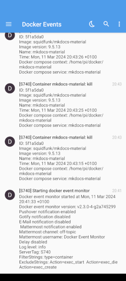

# Docker Event Monitor

Monitor Docker events and send push notifications for each event.



## Features

- Small memory and CPU footprint
- Pushover notification
- Gotify notification
- E-Mail notification (SMTP)
- Mattermost notifications (via Incoming Webhooks)
- Filter and exclude events

## Background

I've been using [Monocker](https://github.com/petersem/monocker) to monitor my Docker containers and get push notifications on status changes. However, it's using polling (with hard lower limit of 10 sec) to poll for status changes. This is too long to catch all status changes (e.g. watchtower updating a container). While I did remove the limit in my own Monocker fork, I noticed that the CPU usage goes up quite a bit for polling times < 1sec.
I needed another soultion, and found [docker-events-notifier](https://github.com/hasnat/docker-events-notifier), but Pushover integration was missing.

So I started to develop my own solution which ended up being a `bash` script doing exactly what I wanted it to do (you can still find it in `/legacy/`). However, the used `jq` caused CPU spikes for each processed event. As I could not find a good solution, I decied to write my own application and to learn something new - [Go](https://go.dev/).

As this is my first Go project there is certaily room for improvements (PR's welcome). It borrows heavily form [Dozzle](https://github.com/amir20/dozzle), which you should give a try if you haven't so far.

## Technical

The application uses Docker's API to connect to the [event stream](https://docs.docker.com/engine/api/v1.43/#tag/System/operation/SystemEvents). Each new event is procesed, logged and can be reported.

## Usage

The simplest way to use the docker event monitor is to run the docker container. It'a very small ( < 10MB) image. You can download it via

```shell
docker pull ghcr.io/yubiuser/docker-event-monitor:latest
```

### Docker compose

```yaml
services:
  docker-event-monitor:
    container_name: docker-event-monitor
    image: ghcr.io/yubiuser/docker-event-monitor:latest
    volumes:
      - /var/run/docker.sock:/var/run/docker.sock:ro
      - /etc/localtime:/etc/localtime:ro
      - ./config.yml:/config.yml:ro
    restart: unless-stopped
```

### Build image locally

I provide a Dockerfile which will build the Docker image locally.

```shell
docker build -t docker-event-monitor:local .
```


### Build binary locally

If you have a suitable `Go` environment set up, you can build the binary from `/src/`. For development, a `devcontainer` with a suitable `Dockerfile` is provided as well. If you run `make build` instead of `go build`, `git` commit/branch/date information are injected into to binary.

### Configuration

Configuration is loaded from a config file, by defaut `config.yml`. The path can be adjusted by `docker-event-monitor --config [path]`.
Currently the following options can be set via `config.yml`

```yaml
---
options:
  filter_strings: ["type=container"]
  exclude_strings: ["Action=exec_start", "Action=exec_die", "Action=exec_create"]
  log_level: debug
  server_tag: My Server

reporter:
  pushover:
    enabled: true
    api_token: xyz
    user_key: abc
  gotify:
    enabled: true
    url: http://gotify.lan
    token: xyz
  mail:
    enabled: true
    from: your.username@provider.com
    to: recipient@provider.com
    user: SMTP Username
    password: SMTP Password
    port: 587
    host: SMTP Host
  mattermost:
    enabled: true
    url: http://mattermost.lan
    channel: Docker Event Channel
    user: Docker Event Bot

```

### Filter and exclude events

Docker Event Monitor offers two options that sound alike, but aren't: `Filter` and `Exclude`.
By default, the docker system event stream will contain **all** events. The `filter` option  is a docker built-in function that allows filtering certain events from the stream. It's a **positive** filter only, meaning it defines which events will pass the filter. The possible filters and syntax are described [here](https://docs.docker.com/engine/reference/commandline/events/#filter).

However, docker has no native support for **negative** filter (let all events pass, except those defined) - so I added it. To distingush it from postive filters, this option is named `exclude`.
Based on how it is implemented, **exclusion happens after filtering**. Together you can create configurations like filtering events of type container, but exclude reporting for a specific container or certain actions.

The syntax for exclusion is also `key=value`.  But as the exclusion happens on the data contained in the reported event, the `key`s are different from those used for `filtering`. E.g. instead of `event`, `Action` is used. To figure out which keys to use, it's best to enable debug logging and carefully inspect the event's data structure. A typical container event looks like

```
{Status:"start", ID:"b4a2a54c4487ddc0bbae006e48ae970d4b2fa4b9fd2bef390d8875cb6158c888", From:"squidfunk/mkdocs-material", Type:"container", Action:"start", Actor:events.Actor{ID:"b4a2a54c4487ddc0bbae006e48ae970d4b2fa4b9fd2bef390d8875cb6158c888", Attributes:map[string]string{"com.docker.compose.config-hash":"cd464ac038ddc9ee7a53599aaa9db6a85a01683a9a08a749582d0c0b8c0a595d", "com.docker.compose.container-number":"1", "com.docker.compose.depends_on":"", "com.docker.compose.image":"sha256:feb8ba83cb7272046551c69a58ec03ecda2306410a07844d22c166e810034aa6", "com.docker.compose.oneoff":"False", "com.docker.compose.project":"mkdocs-material", "com.docker.compose.project.config_files":"/home/pi/docker/mkdocs-material/docker-compose.yml", "com.docker.compose.project.working_dir":"/home/pi/docker/mkdocs-material", "com.docker.compose.service":"mkdocs-material", "com.docker.compose.version":"2.24.5", "image":"squidfunk/mkdocs-material", "name":"mkdocs-material", "org.opencontainers.image.created":"2024-02-10T06:18:18.743Z", "org.opencontainers.image.description":"Documentation that simply works", "org.opencontainers.image.licenses":"MIT", "org.opencontainers.image.revision":"a6286ef3ac3407e8b6c985cf0571fc0e2caa6f5b", "org.opencontainers.image.source":"https://github.com/squidfunk/mkdocs-material", "org.opencontainers.image.title":"mkdocs-material", "org.opencontainers.image.url":"https://github.com/squidfunk/mkdocs-material", "org.opencontainers.image.version":"9.5.9"}}, Scope:"local", Time:1708201602, TimeNano:1708201602805856956}
```

Keys of nested elements are joind by dots. E.g. `Actor.Attributes.com.docker.compose.project` or `Actor.Attributes.image`.
